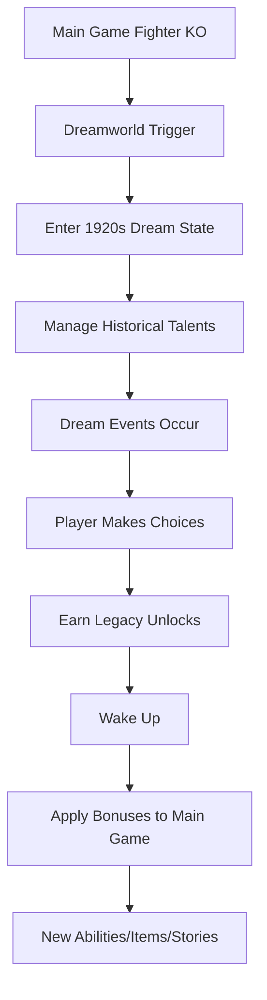

# 🔗 Dreamworld Integration Guide - How It Plugs Into Your Existing System

## Overview

The Dreamworld expansion operates as a **parallel context** to your main game, leveraging your existing systems while adding a surreal, time-shifted management experience. Here's how it seamlessly integrates:

## 🎯 Integration Points

### 1. **Leverages Your Unified Talent/Career System**

```sql
-- dreamworld_talents.career_path links directly to your existing career types
career_path TEXT CHECK (career_path IN ('actor', 'singer', 'boxer', 'sports', 'management', 'mogul'))

-- era_specific_skills use same skill format as main game
era_specific_skills JSONB -- {"charisma": 92, "negotiation": 85}
```

**Integration Example:**
```typescript
// Your existing talent system
const mainGameTalent = {
  id: 'celebrity-123',
  name: 'Modern Fighter',
  skills: { boxing: 90, charisma: 75 }
}

// Dreamworld parallel talent
const dreamworldTalent = {
  id: 'dream-talent-456',
  name: 'Jack Dempsey',
  real_world_link: 'celebrity-123', // Links back to main game
  era_specific_skills: { power: 94, intimidation: 90 }
}
```

### 2. **Integrates with Event Pipeline**

```sql
-- dream_events table follows your event structure
dream_type TEXT -- prophecy, warning, inspiration, nightmare, vision
impact_score INTEGER -- 0-100, affects main game outcomes
actionable_insight TEXT -- guides player actions in both worlds
```

**Event Flow:**
```typescript
// Main game event triggers dreamworld
mainGameEvent: "Fighter Knocked Out" 
  → triggerDreamworld('knockout')
  → generateDreamEvent('prophecy', 'Your fighter sees future victory')
  → returnToMainGame({ bonusMotivation: 20 })

// Dreamworld events affect main game
dreamEvent: "Met Ghost of Louis Armstrong"
  → unlockMainGameBonus({ jazzPromotions: true })
  → addSpecialDialogue('Your fighter hums jazz before fights')
```

### 3. **Uses Press/Rivalry Engines**

```sql
-- dreamworld_talents.relationships JSONB integrates with rivalry system
relationships JSONB -- {"al_capone": "rival", "duke_ellington": "ally"}

-- notoriety field affects press coverage
notoriety INTEGER -- Higher notoriety = more press events
```

**Press Integration:**
```typescript
// Dreamworld notoriety affects main game press
if (dreamTalent.notoriety > 80) {
  mainGame.generatePressEvent({
    type: 'mystery',
    headline: 'Fighter Claims to Dream of Jazz Legends',
    publicityBoost: 15
  })
}
```

## 🗄️ Database Architecture

### Parallel Context Design

```
Main Game Tables          Dreamworld Tables
================          =================
celebrities        <--->   dreamworld_talents (via real_world_link)
events             <--->   dream_events (shared event types)
player_state       <--->   dreamworld_player_state (parallel progress)
```

### Key Relationships

1. **real_world_link**: Direct UUID reference from dreamworld to main game
2. **career_path**: Shared enumeration ensures compatibility
3. **player_id**: Same player manages both contexts

## 🎮 Trigger Mechanisms

### From Main Game → Dreamworld

```typescript
// In your fight result handler
if (fightResult.knockout) {
  const dreamTrigger = {
    type: 'knockout',
    severity: fightResult.damage,
    fighter: fightResult.loser
  }
  activateDreamworld(dreamTrigger)
}

// In your management stress handler
if (manager.stress >= 90) {
  activateDreamworld({ type: 'breakdown' })
}
```

### From Dreamworld → Main Game

```typescript
// Legacy unlocks affect main game stats
const legacyUnlock = {
  type: 'skill',
  name: 'Jazz Era Charisma',
  effect: { charisma: +10, crowdAppeal: +15 }
}

// Apply to main game
mainGameState.applyLegacyBonus(legacyUnlock)
```

## 🌟 Extensibility by Era/Industry

### Easy Era Addition

```sql
-- Just add new era to CHECK constraint
ALTER TABLE dreamworld_talents 
DROP CONSTRAINT dreamworld_talents_dream_era_check,
ADD CONSTRAINT dreamworld_talents_dream_era_check 
CHECK (dream_era IN ('1920s', '1930s', '1940s', '1950s', '1960s', '1970s'));
```

### Industry Expansion

```typescript
// Add new career paths
const newCareerPaths = ['producer', 'director', 'athlete', 'politician']

// Era-specific skills automatically adapt
const era1960sSkills = {
  'rock_and_roll': 85,
  'counterculture': 70,
  'television_presence': 90
}
```

## 🎁 Dream Achievements → Main Game Bonuses

### Achievement Types

1. **Skill Bonuses**: Dream training carries over
   ```typescript
   dreamAchievement: "Trained with Jack Dempsey"
   mainGameBonus: { boxing: +5, intimidation: +10 }
   ```

2. **Unique Items**: Historical artifacts
   ```typescript
   dreamItem: "1920s Championship Belt"
   mainEffect: { prestige: +20, unlockVintagePromotion: true }
   ```

3. **Story Arcs**: New narrative branches
   ```typescript
   dreamConnection: "Al Capone's Protection"
   mainStoryline: "Mysterious benefactor storyline unlocked"
   ```

4. **Hidden Venues**: Speakeasy network
   ```typescript
   dreamDiscovery: "Cotton Club VIP Pass"
   mainUnlock: { venue: "Secret Training Facility", bonus: +15 }
   ```

## 📊 Data Flow Example



## 🔧 Implementation Checklist

- [x] Create parallel database tables
- [x] Link via player_id and real_world_link
- [x] Share career_path enumerations
- [x] Integrate event types
- [x] Create trigger conditions
- [x] Build legacy unlock system
- [x] Add return mechanisms
- [x] Enable era extensibility

## 💡 Best Practices

1. **Keep Contexts Separate**: Dreamworld doesn't directly modify main game tables
2. **Use JSONB Wisely**: Flexible fields for era-specific data
3. **Maintain Referential Integrity**: real_world_link ensures data consistency
4. **Progressive Enhancement**: Dreamworld enhances but never blocks main game
5. **Clear Return Paths**: Multiple ways to wake up and return

---

The Dreamworld operates as an **optional enhancement layer** that enriches your main game without disrupting core gameplay. It's designed to be modular, extensible, and deeply integrated while maintaining clean separation of concerns.